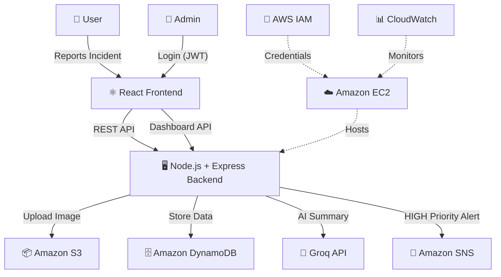

# 🚨 Cloud-Based Disaster Reporting and Alert Management System

A full-stack web application for reporting and managing disaster incidents, built with **React**, **Node.js**, and **AWS Cloud Services** as a Cloud Computing college project.

## 📋 Table of Contents

- [Project Description](#project-description)
- [Features](#features)
- [Architecture](#architecture)
- [Technology Stack](#technology-stack)
- [AWS Services](#aws-services)
- [Project Structure](#project-structure)
- [Local Setup](#local-setup)
- [Environment Variables](#environment-variables)
- [AWS Setup](#aws-setup)
- [API Endpoints](#api-endpoints)
- [Running the Project](#running-the-project)
- [Deployment Plan](#deployment-plan)
- [Security Considerations](#security-considerations)
- [Testing](#testing)
- [Future Enhancements](#future-enhancements)

---

## 📖 Project Description

This application allows users to **report incidents** such as fires, floods, accidents, and other disasters. Reports are processed by the backend which:

1. Determines the **priority** using server-side rules
2. Generates an **AI summary** using the Groq API
3. Uploads optional **images to Amazon S3**
4. Stores incident data in **Amazon DynamoDB**
5. Sends **email alerts via Amazon SNS** for high-priority incidents

Administrators can log in to a **dashboard** to view, filter, search, update, and delete incident reports.

---

## ✨ Features

### Public (User)
- Submit incident reports with type, location, description, and optional image
- View submission confirmation with AI-generated summary and priority
- Client-side form validation and image preview

### Admin Dashboard
- Secure JWT-based login
- View all incidents with statistics (total, pending, in-progress, resolved, high-priority)
- Search by incident ID, location, or description
- Filter by type, priority, and status
- Update incident status (Pending → In Progress → Resolved / Rejected)
- View incident details with uploaded images via presigned S3 URLs
- Delete incidents

### Backend
- RESTful API with Express.js
- Deterministic priority assignment (Fire/Flood → HIGH, Accident/Building Damage → MEDIUM, etc.)
- AI summaries via Groq API with graceful fallback
- Structured JSON logging (CloudWatch-compatible)
- Centralized error handling
- Input validation and file type/size restrictions

---

## 🏗️ Architecture



---

## 🛠️ Technology Stack

| Layer | Technology |
|-------|-----------|
| **Frontend** | React.js, Vite, JavaScript, Tailwind CSS |
| **Backend** | Node.js, Express.js, JavaScript |
| **Database** | Amazon DynamoDB |
| **Storage** | Amazon S3 |
| **Notifications** | Amazon SNS |
| **AI** | Groq API |
| **Auth** | JWT (JSON Web Tokens) |
| **Hosting** | Amazon EC2 (Windows Server) |
| **Monitoring** | Amazon CloudWatch |

---

## ☁️ AWS Services

| Service | Purpose |
|---------|---------|
| **Amazon EC2** | Hosts the Node.js backend on a Windows Server instance |
| **Amazon S3** | Stores incident images in a private bucket; uses presigned URLs for secure access |
| **Amazon DynamoDB** | NoSQL database storing incident records with incidentId as partition key |
| **Amazon SNS** | Sends email notifications when HIGH priority incidents are reported |
| **AWS IAM** | Provides the EC2 instance with an IAM role (`DisasterResponseEC2Role`) for secure access to S3, DynamoDB, and SNS without hardcoded credentials |
| **Amazon CloudWatch** | Collects application logs and monitors server health (via CloudWatch agent on EC2) |

---

## 📁 Project Structure

```
disaster-response-system/
│
├── frontend/
│   ├── src/
│   │   ├── components/        # Reusable UI components
│   │   │   ├── Navbar.jsx
│   │   │   ├── PriorityBadge.jsx
│   │   │   ├── StatusBadge.jsx
│   │   │   └── LoadingSpinner.jsx
│   │   ├── pages/             # Route pages
│   │   │   ├── ReportIncident.jsx
│   │   │   ├── IncidentSubmitted.jsx
│   │   │   ├── AdminLogin.jsx
│   │   │   ├── AdminDashboard.jsx
│   │   │   └── IncidentDetails.jsx
│   │   ├── services/          # API communication
│   │   │   └── api.js
│   │   ├── context/           # React Context
│   │   │   └── AuthContext.jsx
│   │   ├── App.jsx
│   │   ├── main.jsx
│   │   └── index.css
│   ├── .env.example
│   ├── index.html
│   ├── vite.config.js
│   └── package.json
│
├── backend/
│   ├── src/
│   │   ├── config/            # Configuration & AWS clients
│   │   │   ├── index.js
│   │   │   └── aws.js
│   │   ├── controllers/       # Request handlers
│   │   │   ├── incidentController.js
│   │   │   └── authController.js
│   │   ├── middleware/         # Express middleware
│   │   │   ├── auth.js
│   │   │   ├── upload.js
│   │   │   └── errorHandler.js
│   │   ├── routes/            # API routes
│   │   │   ├── incidentRoutes.js
│   │   │   └── authRoutes.js
│   │   ├── services/          # Business logic & AWS integrations
│   │   │   ├── dynamoService.js
│   │   │   ├── s3Service.js
│   │   │   ├── snsService.js
│   │   │   └── groqService.js
│   │   ├── utils/             # Utilities
│   │   │   ├── idGenerator.js
│   │   │   ├── priority.js
│   │   │   └── logger.js
│   │   └── server.js          # Express app entry point
│   ├── .env.example
│   └── package.json
│
├── .gitignore
└── README.md
```

---

## 🚀 Local Setup

### Prerequisites

- **Node.js** v18+ and npm
- **AWS CLI** configured with credentials (`aws configure`)
- **Git**

### 1. Clone the Repository

```bash
git clone https://github.com/Genix2096/disaster-response-system.git
cd disaster-response-system
```

### 2. Backend Setup

```bash
cd backend
npm install
```

Copy `.env.example` to `.env` and fill in your values:

```bash
copy .env.example .env
```

Edit `.env` with your actual values:

```env
PORT=5000
NODE_ENV=development
AWS_REGION=ap-south-1
S3_BUCKET_NAME=disaster-response-images-mural-2026
DYNAMODB_TABLE_NAME=DisasterReports
SNS_TOPIC_ARN=arn:aws:sns:ap-south-1:ACCOUNT_ID:DisasterAlerts
GROQ_API_KEY=your-groq-api-key
GROQ_MODEL=llama-3.1-8b-instant
ADMIN_USERNAME=admin
ADMIN_PASSWORD=your-secure-password
JWT_SECRET=your-jwt-secret
FRONTEND_URL=http://localhost:5173
```

### 3. Frontend Setup

```bash
cd ../frontend
npm install
```

Copy `.env.example` to `.env`:

```bash
copy .env.example .env
```

The default value `VITE_API_URL=http://localhost:5000` should work for local development.

---

## 🔐 Environment Variables

### Backend (`backend/.env`)

| Variable | Description |
|----------|-------------|
| `PORT` | Server port (default: 5000) |
| `NODE_ENV` | Environment (development/production) |
| `AWS_REGION` | AWS region (ap-south-1) |
| `S3_BUCKET_NAME` | S3 bucket for images |
| `DYNAMODB_TABLE_NAME` | DynamoDB table name |
| `SNS_TOPIC_ARN` | SNS topic ARN for alerts |
| `GROQ_API_KEY` | Groq API key for AI summaries |
| `GROQ_MODEL` | Groq model name |
| `ADMIN_USERNAME` | Admin login username |
| `ADMIN_PASSWORD` | Admin login password |
| `JWT_SECRET` | Secret for JWT signing |
| `FRONTEND_URL` | Frontend URL for CORS |

### Frontend (`frontend/.env`)

| Variable | Description |
|----------|-------------|
| `VITE_API_URL` | Backend API URL |

> **⚠️ Important:** AWS credentials are NOT stored in `.env`. The application uses the AWS SDK default credential provider chain. For local development, configure credentials via `aws configure`.

---

## ☁️ AWS Setup

### 1. Amazon S3

Create a bucket named `disaster-response-images-mural-2026` in `ap-south-1`:
- **Block all public access** ✅
- Images are accessed via presigned URLs only

### 2. Amazon DynamoDB

Create a table named `DisasterReports` in `ap-south-1`:
- **Partition key:** `incidentId` (String)
- Use on-demand capacity for cost efficiency

### 3. Amazon SNS

Create a topic named `DisasterAlerts` in `ap-south-1`:
- Add email subscriptions for administrators
- Confirm the email subscription
- Copy the Topic ARN to your `.env`

### 4. AWS IAM

Create an IAM role named `DisasterResponseEC2Role`:
- **Trusted entity:** EC2
- **Policies:** S3, DynamoDB, SNS, CloudWatch access
- Attach this role to the EC2 instance

### 5. Amazon EC2

- Launch a **Windows Server** instance in `ap-south-1`
- Attach the `DisasterResponseEC2Role` IAM role
- Install Node.js on the instance
- Configure security groups to allow inbound traffic on ports 80/443/5000

---

## 📡 API Endpoints

| Method | Endpoint | Auth | Description |
|--------|----------|------|-------------|
| `GET` | `/api/health` | No | Health check |
| `POST` | `/api/incidents` | No | Submit a new incident (multipart/form-data) |
| `POST` | `/api/auth/login` | No | Admin login (returns JWT) |
| `GET` | `/api/incidents` | JWT | Get all incidents |
| `GET` | `/api/incidents/:id` | JWT | Get incident by ID |
| `PATCH` | `/api/incidents/:id/status` | JWT | Update incident status |
| `DELETE` | `/api/incidents/:id` | JWT | Delete incident |

### Submit Incident (POST /api/incidents)

**Content-Type:** `multipart/form-data`

| Field | Type | Required | Description |
|-------|------|----------|-------------|
| `type` | string | Yes | Fire, Flood, Accident, Road Damage, Building Damage, Other |
| `location` | string | Yes | Incident location (max 500 chars) |
| `description` | string | Yes | Incident description (max 5000 chars) |
| `image` | file | No | JPEG, PNG, or WEBP image (max 5 MB) |

---

## 🏃 Running the Project

### Start Backend

```bash
cd backend
npm run dev
```

Backend runs at: `http://localhost:5000`

### Start Frontend

```bash
cd frontend
npm run dev
```

Frontend runs at: `http://localhost:5173`

### Verify

1. Open `http://localhost:5173` in your browser
2. Test health check: `http://localhost:5000/api/health`
3. Submit an incident via the form
4. Log in to admin dashboard with your credentials

---

## 🚢 Deployment Plan

### EC2 Windows Server Deployment

1. **Connect** to the EC2 instance via RDP
2. **Install** Node.js (v18+)
3. **Clone** the repository on the EC2 instance
4. **Install** dependencies (`npm install` in both `frontend/` and `backend/`)
5. **Configure** `backend/.env` with production values
6. **Build** the frontend: `npm run build` in `frontend/`
7. **Start** the backend: `npm start` in `backend/`
8. **Serve** the frontend build via the backend or a web server (e.g., IIS)
9. **Configure** Windows Firewall and EC2 Security Groups

The EC2 instance's IAM role (`DisasterResponseEC2Role`) automatically provides AWS credentials — no access keys needed on the server.

---

## 🔒 Security Considerations

- **No hardcoded credentials** — AWS SDK uses the default credential provider chain
- **Private S3 bucket** — images accessed only via time-limited presigned URLs
- **JWT authentication** — admin routes protected with Bearer tokens
- **Input validation** — all user input validated on the server
- **File restrictions** — only JPEG/PNG/WEBP images up to 5 MB accepted
- **CORS configured** — only the frontend origin is allowed
- **Error sanitization** — internal errors never exposed to clients
- **`.gitignore`** — `.env`, keys, and secrets excluded from version control
- **Structured logging** — no secrets in log output

---

## 🧪 Testing

### Manual Test Checklist

| # | Test | Expected Result |
|---|------|----------------|
| 1 | Backend starts | Server running on port 5000 |
| 2 | `GET /api/health` | Returns `{"status": "ok"}` |
| 3 | Submit incident via form | Incident created with ID, priority, AI summary |
| 4 | Check DynamoDB | Record exists in `DisasterReports` table |
| 5 | Upload image | Image stored in S3 bucket |
| 6 | AI summary | Groq generates a concise summary |
| 7 | HIGH priority incident | SNS email notification sent |
| 8 | Admin login | JWT token returned |
| 9 | View incidents | All incidents displayed in dashboard |
| 10 | View image | Presigned URL loads the S3 image |
| 11 | Update status | Status changes reflected in DynamoDB |
| 12 | Delete incident | Incident and S3 image removed |
| 13 | Groq API down | Incident still created with fallback summary |
| 14 | SNS failure | Incident still created; error logged |
| 15 | Invalid file upload | Rejected with error message |
| 16 | Secrets not exposed | No credentials in API responses or frontend code |

---

## 🔮 Future Enhancements

- Real-time incident notifications using WebSockets
- Geolocation-based incident mapping (Google Maps integration)
- Role-based access control for multiple admin levels
- Incident statistics and analytics dashboard
- SMS notifications via Amazon SNS
- Automated incident categorization using AI
- Incident response workflow with assignment tracking
- Mobile-responsive progressive web app (PWA)
- Multi-language support
- Incident archival and export functionality

---

## 📄 License

This project was developed as a **Cloud Computing college project** demonstrating the integration of multiple AWS services with a modern web application.

---

**GitHub:** [https://github.com/Genix2096/disaster-response-system](https://github.com/Genix2096/disaster-response-system)
